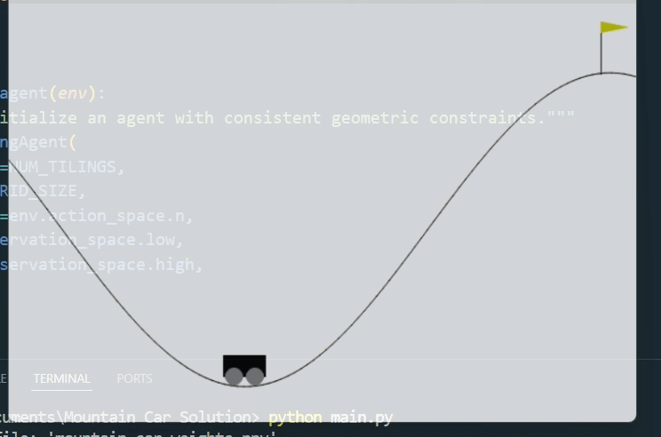

# Description
This is a Reinforced Learning implementation of an agent to solve Gymnasium's Mountain Car problem, by utilizing Tile Coding technique to update Q-Table.

## Architecture
The project consists of the following files:

**1.** `title_coder.py`: This manages the geometric transformations. It takes continuous state values of position and velocity from the environment and maps them into an array of multilayered tile IDs.

**2.** `agent.py`: Updates the weights in the weight matrix, handles decision making of exploration or exploitation via the epsilon greedy factor, and calculates the Temporal Difference (TD), which is crucial to solve this problem.

**3.** `main.py`: Consists of training loop and provides a visual illustration of agent in action.

## Probelm and its solution

**The Problem:** The problem with this environment is that the agent constantly receives a negative reward (-1) for each frame. And since the environment is in continuous values, the agent can't learn quickly because it can't understand
the proximity; for example, it treats 0.001 and 0.002 as seperate areas which means it could take forever to learn.

**Solution:** The implementation of Tile Coding solves this problem elegantly. Tile coding takes distinct tiles, creates multiple layers. Then, the layers are taken one-by-one, stacked on top of previous layer and the next layer
is shifted to the upper-right by an offset. This has certain advantages:

- The continuous values are now taken as discrete tiles which is efficient to learn.
- It increases the resolution of each tile; for example a tile spans from 0.0 to 1.0 but there can be a big difference between 0.1 and 0.9, and this resolution increase will account for that.
- By having these overlapping tiles, the agent will be able to understand the proximity of tiles as the array consists of active tiles that will be affected.
- By calculating Temporal Difference (TD), the agent will choose to explore unexplored tiles as they will have a greater value than explored tiles due to negative rewards on visited ones. The unexplored will have greater
  negative values (ex: an unexplored tile would have -0.5 whereas an explored tile could have -1.5 which means the agent will choose the unexplored one to maximise reward).

## Results
Have a look at it:

## How To Run
Running the program is easy.

**1.** Clone the repo.

**2.** install libraries from `requirements.txt`.

**3.** Now you can run the project using the command: `python main.py`. You can either use my weights table or run a training loop with your own parameters.

